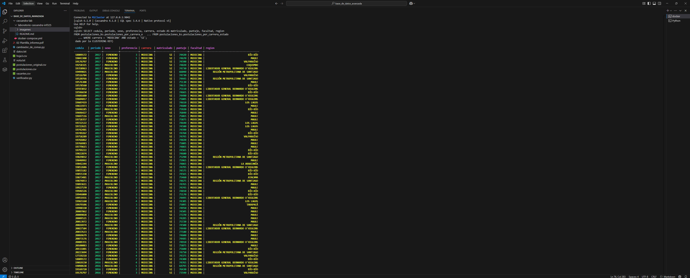
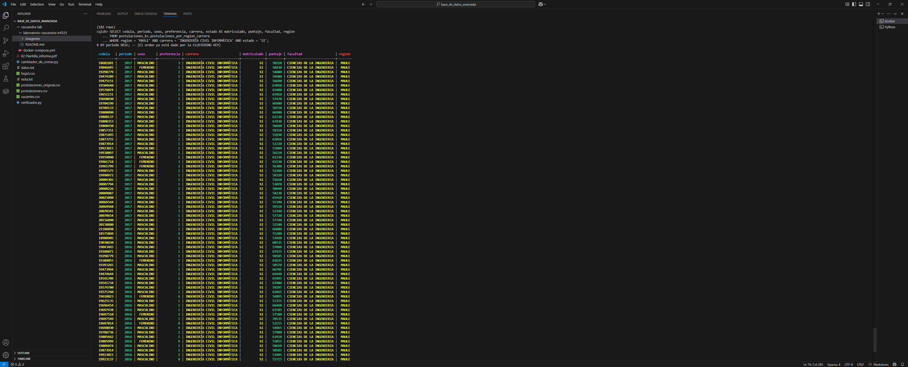
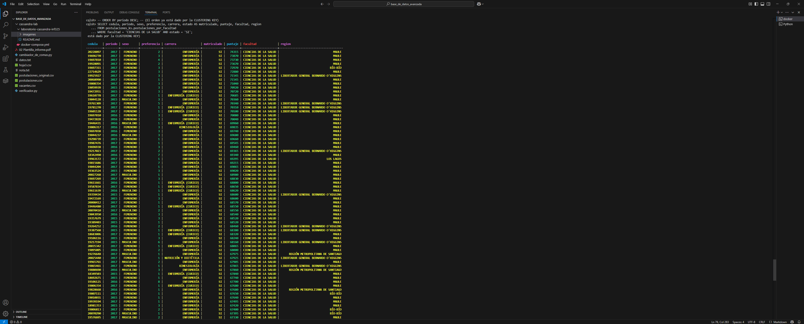

# 📘 Guía para Consultas CQL (Requisito 3 – INF325)

---

## ⚙️ Prerrequisitos

Antes de proceder con la ejecución de las consultas, asegúrate de lo siguiente:

1.  **Clúster Cassandra Operativo**: Los tres nodos (`cassandra1`, `cassandra2`, `cassandra3`) están corriendo (verificado en Requisito 1).
2.  **Esquema de BD Creado**: El `keyspace` (ej. `postulaciones_ks`) y las tablas (`postulaciones_por_carrera_estado`, `postulaciones_por_region_carrera`, `postulaciones_por_facultad`) existen (creados en Requisito 2).
3.  **Datos Cargados**: Los datos de `postulaciones.csv` han sido cargados en las tablas correspondientes.
4.  **Acceso a `cqlsh`**:
    *   Conéctate a `cqlsh` en uno de los nodos (usualmente `cassandra1`).
    *   Selecciona el `keyspace` de trabajo.

    ```bash
    # Conectar al contenedor cassandra1 e iniciar cqlsh
    docker exec -it cassandra1 cqlsh
    ```

    Una vez dentro de `cqlsh`:
    ```cql
    USE postulaciones_ks; -- Reemplaza postulaciones_ks si usaste otro nombre
    ```

---

## 🔍 Ejecución de Consultas CQL

A continuación, se detallan las consultas a ejecutar.

### ❓ Consulta 3.a: Postulantes de Medicina por Periodo

**1. Enunciado de la Consulta:**
> Devolver todos los postulantes matriculados en la carrera de Medicina, ordenados por PERIODO.

**2. Tabla y Justificación del Diseño:**
*   **Tabla Destino:** `postulaciones_ks.postulaciones_por_carrera_estado`
*   **Justificación Breve:**
    *   Diseñada con `PRIMARY KEY ((carrera, estado), periodo, cedula)` y `WITH CLUSTERING ORDER BY (periodo DESC, cedula ASC)`.
    *   La **Partition Key** `(carrera, estado)` permite un filtrado directo y eficiente por `carrera = 'MEDICINA'` y `estado = 'SI'`.
    *   La **Clustering Column** `periodo` asegura el ordenamiento físico por periodo dentro de la partición.

**3. Sentencia CQL:**
```cql
SELECT
    cedula,
    periodo,
    sexo,
    preferencia,
    carrera,
    estado AS matriculado, -- 'estado' es la columna original en la tabla
    puntaje,
    facultad,
    region
FROM postulaciones_ks.postulaciones_por_carrera_estado
WHERE carrera = 'MEDICINA' AND estado = 'SI';
-- El ordenamiento por 'periodo DESC' es implícito por el diseño de la tabla.



❓ Consulta 3.b: Postulantes de Ing. Civil Informática en Maule por Periodo
1. Enunciado de la Consulta:
Devolver todos los postulantes matriculados provenientes de la Región del Maule en la carrera Ingeniería Civil Informática, ordenados por PERIODO.
2. Tabla y Justificación del Diseño:
Tabla Destino: postulaciones_ks.postulaciones_por_region_carrera
Justificación Breve:
Diseñada con PRIMARY KEY ((region, carrera, estado), periodo, cedula) y WITH CLUSTERING ORDER BY (periodo DESC, cedula ASC).
La Partition Key (region, carrera, estado) permite un filtrado directo y eficiente por los tres criterios.
La Clustering Column periodo ordena los resultados.
3. Sentencia CQL:
SELECT
    cedula,
    periodo,
    sexo,
    preferencia,
    carrera,
    estado AS matriculado,
    puntaje,
    facultad,
    region
FROM postulaciones_ks.postulaciones_por_region_carrera
WHERE region = 'MAULE' AND carrera = 'INGENIERÍA CIVIL INFORMÁTICA' AND estado = 'SI';
-- El ordenamiento por 'periodo DESC' es implícito.
-- (Verifica que 'MAULE' e 'INGENIERÍA CIVIL INFORMÁTICA' coincidan con tus datos)
Use code with caution.
Cql
Resultado Esperado (Ejemplo):

❓ Consulta 3.c: Postulantes de Ciencias de la Salud por Puntaje PSU
1. Enunciado de la Consulta:
Devolver todos los postulantes matriculados en la facultad de Ciencias de la Salud, ordenados por PUNTAJE PSU.
2. Tabla y Justificación del Diseño:
Tabla Destino: postulaciones_ks.postulaciones_por_facultad
Justificación Breve:
Diseñada con PRIMARY KEY ((facultad, estado), puntaje, cedula) y WITH CLUSTERING ORDER BY (puntaje DESC, cedula ASC).
La Partition Key (facultad, estado) permite un filtrado eficiente.
La Clustering Column puntaje ordena los resultados por puntaje PSU.
3. Sentencia CQL:
SELECT
    cedula,
    periodo,
    sexo,
    preferencia,
    carrera,
    estado AS matriculado,
    puntaje, -- Esta es la columna de Puntaje PSU
    facultad,
    region
FROM postulaciones_ks.postulaciones_por_facultad
WHERE facultad = 'CIENCIAS DE LA SALUD' AND estado = 'SI';
-- El ordenamiento por 'puntaje DESC' es implícito.
-- (Verifica que 'CIENCIAS DE LA SALUD' coincida con tus datos)
Use code with caution.
Cql
Resultado Esperado (Ejemplo):

